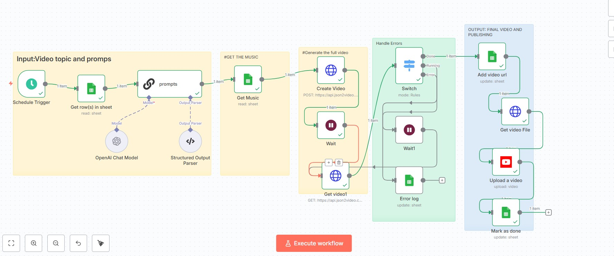
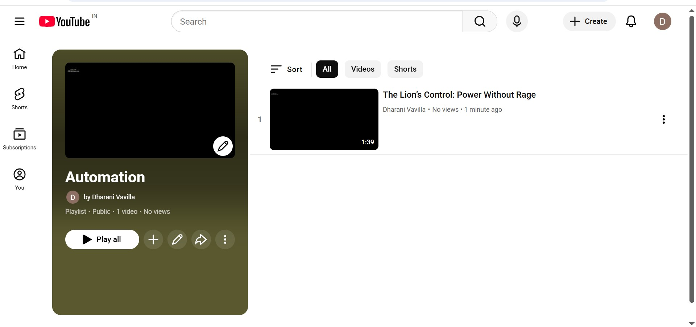
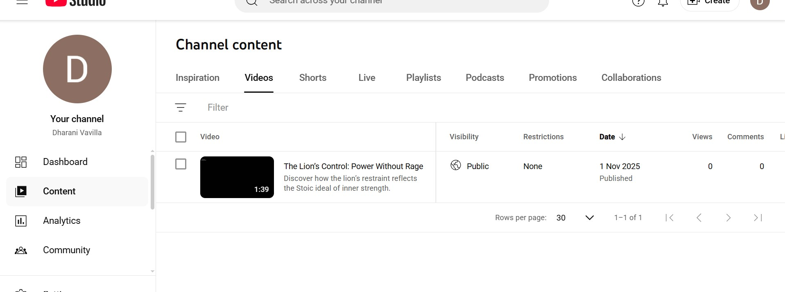
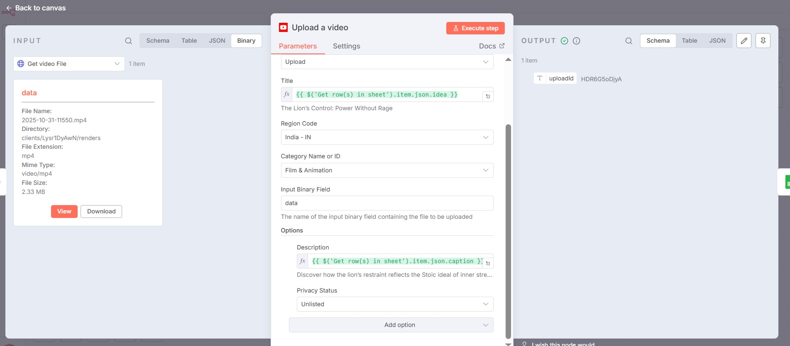

# YouTube n8n Automation — README

**Workflow Name:** YouTube n8n
**Workflow File:** `youtuben8n (1).json`

---

## Overview

This document explains the **YouTube automation system** built using **n8n**, which converts ideas from Google Sheets into AI-generated YouTube videos automatically. The system integrates **OpenAI**, **json2video**, **Google Sheets**, and **YouTube Data API** to run end-to-end video creation hourly.

---

## Workflow Flowchart

```
[Schedule Trigger]
     │
     ▼
[Get Row(s) in Sheet] ──► [OpenAI Prompt Generator] ──► [Structured Output Parser]
     │                                               │
     ▼                                               ▼
[Get Music]                                  [Create Video (json2video)]
     │                                               │
     ▼                                               ▼
[Wait] ──► [Get Video Status] ──► [Switch Node]
     │                │                   │
     │                ├──► (Running) ─► [Wait1 → Retry]
     │                ├──► (Error) ───► [Error Log → Update Sheet]
     │                └──► (Done) ───► [Add Video URL]
     │
     ▼
[Get Video File] ──► [Upload to YouTube] ──► [Mark as Done in Sheet]
```

---

## Node-by-Node Explanation

* **Schedule Trigger**
  Triggers the workflow automatically every hour to check the sheet for pending ideas.

* **Get Row(s) in Sheet**
  Reads rows from Google Sheets where `production_status = for production`.

* **OpenAI Chat Model (Prompt Generator)**
  Uses GPT-4 or GPT-4-mini to create JSON-formatted prompts for 10 scenes including voice text and image prompts.

* **Structured Output Parser**
  Ensures OpenAI’s response is valid JSON before moving forward.

* **Get Music**
  Fetches background music URL or file name from another sheet for video rendering.

* **Create Video (json2video)**
  Sends the generated prompts and music to the **json2video API** to start rendering.
  Template ID example: `mEjkqxGJE4DTdpE8f62q`

* **Wait**
  Waits for a specified period (e.g., 60 seconds) before checking the video status.

* **Get Video1 (Check Status)**
  Polls the API to check rendering progress. Returns `movie.status` as `done`, `running`, or `error`.

* **Switch Node**

  * If `running` → goes back to **Wait1**
  * If `done` → proceeds to YouTube upload
  * If `error` → logs details in the Google Sheet

* **Add Video URL**
  Updates Google Sheet with the generated `final_output` (video link) and marks as `done`.

* **Get Video File**
  Downloads the rendered MP4 file from the provided URL.

* **Upload a Video (YouTube Node)**
  Uploads the video using YouTube Data API with parameters:

  * Title: `idea` column value
  * Description: `caption` column value
  * Privacy: `Unlisted`

* **Mark as Done (Sheet Update)**
  Updates Google Sheet column `publishing_status` to `done` once upload completes.

---

## Workflow Screenshots

# Workflow Snapshot



# Google Sheets Connection

*(Shows connection setup for reading and updating production sheet)*

# YouTube Upload Node



# Video Unlisted Status



# Uploaded Video Confirmation



---

## Google Sheet Structure Example

| id | idea               | caption            | channel_style_prompt    | character_style_prompt | production_status | final_output  | publishing_status | error_log |
| -- | ------------------ | ------------------ | ----------------------- | ---------------------- | ----------------- | ------------- | ----------------- | --------- |
| 1  | The Lion’s Control | Power Without Rage | Royal storytelling tone | Lion’s calm power      | for production    | (auto-filled) | (auto)            | (auto)    |

---

## Credentials Required

* **Google Sheets OAuth2** – For read/write access.
* **OpenAI API Key** – For Chat Model prompt generation.
* **json2video API Key** – To render video scenes.
* **YouTube OAuth2** – Must have `youtube.upload` permission scope.

---

## AI Model Instruction Example

```
You are an expert visual storyteller.
Given a video title and caption, generate 10 JSON objects as follows:
[
  {
    "voiceText": "A narration line in calm tone",
    "image_prompt": "A visual scene prompt for this narration"
  }
]
Return only valid JSON.
```

---

## Troubleshooting

* **Output Parser Error:** Ensure OpenAI returns clean JSON.
* **Render Error (json2video):** Check API key and JSON payload fields.
* **YouTube Upload Fails:** Refresh OAuth credentials.
* **Sheet Not Updating:** Confirm correct Google Sheet ID and GID values.

---

## Best Practices

* Use **secure credentials** via n8n’s credentials store.
* Keep YouTube uploads **unlisted** during testing.
* Avoid overloading API requests; schedule hourly runs.
* Ensure output JSON validation in OpenAI step.

---

## Extending the Workflow

* Add **Thumbnail Generation** using image generation API.
* Integrate **Custom Voice API** for voiceovers.
* Implement **Slack Notifications** on success/failure.
* Add retry count logic for render polling.

---

## Files Summary

* `youtuben8n (1).json` – Workflow JSON
* `youtube_n8n_workflow.jpg` – Full workflow visual
* `youtube_n8n_video_upl.jpg` – YouTube upload node
* `youtube_n8n_video_unlisted.jpg` – Unlisted video status
* `youtube_n8n_video_uploaded.jpg` – Final upload confirmation

---
PPT LINK: https://www.canva.com/design/DAGvlwgNsXQ/h2wBa4fPdpBfSu7mu7J-Tw/edit
## Conclusion

This n8n workflow provides an end-to-end automated system to convert AI-generated ideas into ready-to-upload YouTube videos, maintaining a seamless integration between Sheets, AI prompts, video rendering, and publishing.
